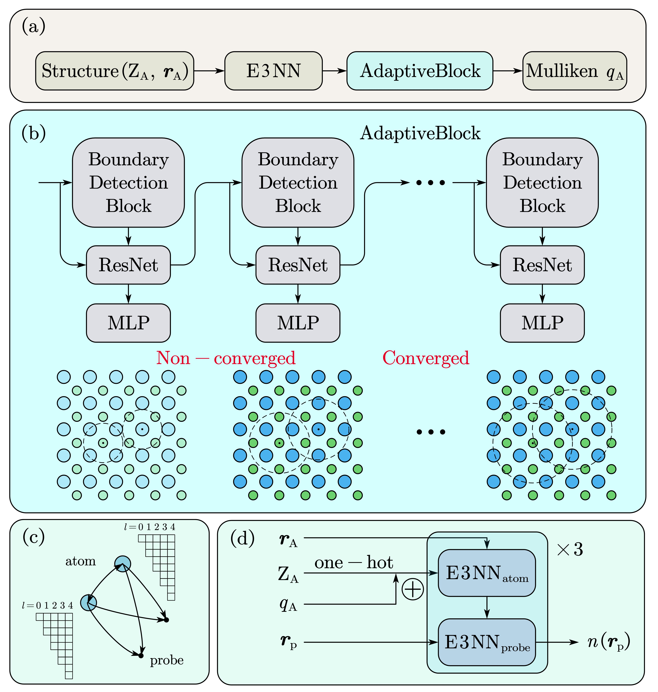

# AdaptiveNet



AdaptiveNet capture long-range effects through an iterative module, which decouple global charge equilibration from electron density prediction.

## Usage

Install dependencies in environment:

```bash
conda env create -f environment.yml
```

### Test Pretrained Models

For Materials Project data, use the npz data file which has been generated by the authors, or download from web by the instruction in  [Datasets](#datasets).

Test the performance of AdaptiveNet on electron density by:

```bash
python src/test_whole.py -cd configs/AdaptiveNet -cn train_whole.yaml -m
```

To test the performance of AdaptiveNet on Mulliken charges, use:

```bash
python src/test_from_config.py -cd configs/AdaptiveNet -cn train_mp_e3_q.yaml -m
```

### Inference electron density on new structure with AdaptiveNet

Different settings used in VASP would result different grid for discretizing electron density. To make the predicted electron density effective, AdaptiveNet needs the grid which are indicated in CHGCAR. This CHGCAR can be obtained by superposition of atomic electron density.

1. Put this CHGCAR in new folder `inference`  in root directory and run:

   ```bash
   python convert_chgcar_dir_to_pkl_dir.py --input="inference" --output="inference" --workers=1
   ```

   This step is to convert CHGCAR file to files necessary in AdaptiveNet.

2. To predict electron density, run:

   ```bash
   Python src/inference_from_config.py -cd "configs/AdaptiveNet" -cn "test_chgcar_inputs_new.yaml"
   ```

   The GPUs settings in `test_chgcar_inputs_new.yaml` can be adapted according to resources. To make fully use of GPU and its VRAM, adjust the `max_grid_construction_size` in `configs/AdaptiveNet/data/inference_data.yaml`. Larger `max_grid_construction_size` can consume more VRAM.

3. To transform predicted electron density file into CHGCAR, run:

   ```bash
   cp inference/*.pkl test_file/cubes/
   python convert_pkl_dir_to_chgcar_dir.py "test_file" "inference" "test_file" --workers=1
   ```

   Then the CHGCAR with predicted electron density can be seen in `test_file`.

### Interface AdaptiveNet with VASP to relax structures

Put the POSCAR constructed in root directory, and directly submit the calculation by:

```bash
sbatch relax_loop.sh
```

Adjust the bash file to properly set the path of VASP, the partition of SLURM and number of nodes for running of VASP. Before running this script, change the number of GPUs written after "gres" in this script according to your resource.

Specifically, the pseudo potential used in VASP calculation must be the same with those used for training data, which are listed in `pbe version.xlsx`.

### Train Models From Scratch

For the training of Mulliken charges, run:

```bash
python src/train_from_config.py -cd "configs/AdaptiveNet" -cn "train_mp_e3_q.yaml"
```

For the training of electron density, run:

```bash
python src/train_from_config.py -cd "configs/AdaptiveNet" -cn "train_mp_e3_q_density.yaml"
```


## Datasets


### Materials Project

1. Use the download script to download CHGCAR via the [Materials Project API](https://github.com/materialsproject/api) :

```bash
python download/download_materials_project.py \
	--out_path ./data/mp_raw \
	--workers 5\
	--task_id_file ./data/mpid_to_task_id_map.json \
	--mp_api_key <MP API key>
```

API key can be obtained in Materials Project.

2. Convert the CHGCAR files in directory mp_raw into pkl and npy file in directory mp:
```bash
python batch_pickle_mp_charge_density.py --raw_data_dir ./data/mp_raw --pkl_data_dir ./data/mp/
```

Theoretically, the rest steps are not necessary unless there is data issue.

3. Create filelist by `ls ./data/mp_raw -1 >  ./data/mp/filelist.txt`
4. Generate a file containing CHGCAR information.
```bash
python write_mp_probe_count_file.py --filelist ./data/mp_raw/filelist.txt --workers WORKERS
```
5. Write the datasplits with [scripts/write_mp_datasplits.py](./scripts/write_mp_datasplits.py).
